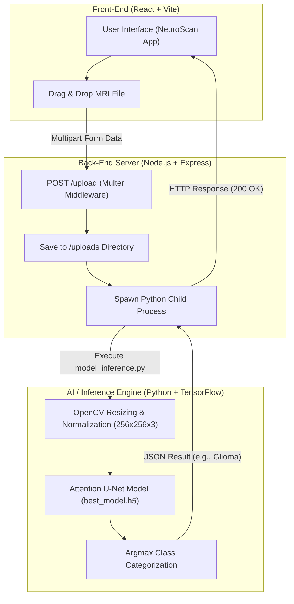

# 🧠 NeuroScan — Brain Tumor Detector & Classifier

[](https://www.python.org/)
[](https://www.tensorflow.org/)
[](https://nodejs.org/)
[](https://react.dev/)
[](https://vitejs.dev/)
[](https://tailwindcss.com/)
[](LICENSE)

**NeuroScan** is an end-to-end medical AI application designed for automated detection and classification of brain tumors from Magnetic Resonance Imaging (MRI) scans. Powered by a custom **Attention U-Net Deep Learning architecture**, NeuroScan delivers high-accuracy multi-class tumor categorization paired with a responsive, modern web application interface.

---

## 📌 Table of Contents

- [Overview](#-overview)
- [Key Features](#-key-features)
- [System Architecture](#-system-architecture)
- [Deep Learning Model & Performance](#-deep-learning-model--performance)
  - [Supported Tumor Classes](#supported-tumor-classes)
  - [Model Architecture](#model-architecture)
  - [Training & Performance Metrics](#training--performance-metrics)
- [Project Structure](#-project-structure)
- [Tech Stack](#-tech-stack)
- [Getting Started](#-getting-started)
  - [Prerequisites](#prerequisites)
  - [1. Backend Setup](#1-backend-setup)
  - [2. Frontend Setup](#2-frontend-setup)
  - [3. Model Weights](#3-model-weights)
- [API Reference](#-api-reference)
- [Troubleshooting & FAQ](#-troubleshooting--faq)
- [Medical Disclaimer](#-medical-disclaimer)
- [License](#-license)

---

## 🧠 Overview

Early identification of brain tumors is vital for effective surgical planning and patient prognosis. Manual MRI interpretation requires specialized radiologist expertise and can be time-intensive during emergency diagnostics.

**NeuroScan** bridges academic deep learning research with clinical application by integrating an **Attention-guided U-Net Convolutional Neural Network** with a lightweight Node.js/Express API server and an interactive React web client. Healthcare researchers and practitioners can drag and drop MRI scans (JPEG, PNG, DICOM) to receive instantaneous automated classification.

---

## ✨ Key Features

- **Multi-Class Classification**: Accurately categorizes brain scans into **Glioma**, **Meningioma**, **Pituitary Tumor**, or **No Tumor**.
- **Attention U-Net Architecture**: Uses soft spatial attention blocks (`attention_block`) to highlight relevant pathological regions while suppressing background noise.
- **Asynchronous REST API Bridge**: Node.js backend spawns isolated Python worker sessions to execute Keras inferences efficiently.
- **Modern Responsive Web GUI**: Built using React 19, Vite, and Tailwind CSS v4, featuring drag-and-drop file uploaders (`react-dropzone`) and smooth scroll animations (`aos`).
- **Medical Image Support**: Native parsing for standard formats (`.jpg`, `.jpeg`, `.png`) as well as medical imaging slices (`.dcm`).
- **Automated Preprocessing**: Real-time image resizing (`256x256`), BGR-to-RGB conversion, and $[0, 1]$ pixel intensity normalization.

---

## 🏗️ System Architecture



---

## 🔬 Deep Learning Model & Performance

### Supported Tumor Classes

NeuroScan classifies input MRI scans into four distinct diagnostic targets:

| Class ID | Target Label | Description |
| :---: | :--- | :--- |
| `0` | **Glioma** | Primary tumor originating from glial cells within the brain tissue. |
| `1` | **Meningioma** | Tumor developing from the meningeal membranes surrounding the brain. |
| `2` | **No Tumor** | Normal brain scan without detectable neoplastic growth. |
| `3` | **Pituitary** | Neoplasm located in the pituitary gland at the base of the brain. |

### Model Architecture

The neural network replaces standard U-Net classification heads with **Attention Gates**:

- **Input Tensor**: `(256, 256, 3)` RGB spatial resolution.
- **Encoder**: 4 feature-extraction blocks featuring double `Conv2D` filters (64, 128, 256, 512) followed by `MaxPooling2D`.
- **Attention Gates**: Intercepts skip connections between encoder and decoder to filter out irrelevant anatomic structures.
- **Classification Head**: `GlobalAveragePooling2D` coupled with a 4-class `Softmax` output dense layer.

```
Input (256x256x3) ──► Encoder ──► Attention Gates ──► Bottleneck (512 filters)
                                         │
Global Average Pooling ◄── Decoder ◄─────┘
         │
Softmax Output (4 Classes)
```

### Training & Performance Metrics

- **Dataset**: Brain Tumor MRI Dataset (divided into `Training/` and `Testing/` splits).
- **Augmentation**: Rotation ($\pm 20^\circ$), Zoom ($0.2$), Horizontal Flip.
- **Target Accuracy**: Custom callback (`StopOnAccuracy`) halts training when model reaches $\ge 96\%$ accuracy.
- **Early Stopping**: Monitored on `val_loss` with a patience threshold of 15 epochs.
- **Model Checkpoint**: Automatically saves top weights to `best_model.h5`.

---

## 📁 Project Structure

```
Brain-Tumor-Detector/
├── Back-End/
│   ├── uploads/               # Temporary directory storing uploaded MRI files
│   ├── model_inference.py     # Python script for image preprocessing & model execution
│   ├── server.js              # Express REST API server handling file uploads & process spawning
│   ├── package.json           # Node.js backend configuration & dependencies
│   └── best_model.h5          # Trained TensorFlow/Keras model file (place here)
├── Front-End/
│   ├── src/
│   │   ├── components/        # UI components & image assets
│   │   └── assests/           # Brand icons & illustrations
│   ├── index.html             # HTML entry point (NeuroScan Web Application)
│   ├── vite.config.js         # Vite build configuration
│   └── package.json           # React 19 dependencies & scripts
├── model/
│   └── model.ipynb            # Google Colab notebook for Attention U-Net training
└── README.md                  # Detailed project documentation
```

---

## 🛠️ Tech Stack

- **Deep Learning / Computer Vision**: TensorFlow 2.x, Keras, OpenCV (`cv2`), NumPy, Matplotlib, Seaborn, Scikit-learn
- **Backend Service**: Node.js, Express.js, Multer, Cors
- **Frontend Client**: React 19, Vite, Tailwind CSS v4, React Icons, React Dropzone, AOS (Animate On Scroll)

---

## 🚀 Getting Started

### Prerequisites

Ensure the following runtimes are installed on your machine:
- **Node.js** (v18.0 or higher) & **npm**
- **Python** (v3.9 or higher)
- **TensorFlow** (`pip install tensorflow numpy opencv-python`)

---

### 1. Backend Setup

1. Open a terminal and navigate to `Back-End`:
   ```bash
   cd Back-End
   ```

2. Install Node.js dependencies:
   ```bash
   npm install
   ```

3. Ensure Python dependencies are available:
   ```bash
   pip install tensorflow opencv-python numpy
   ```

4. Place your trained model file (`best_model.h5`) inside `Back-End/`.

5. Start the backend API server:
   ```bash
   npm start
   ```
   The server will launch at `http://localhost:5000`.

---

### 2. Frontend Setup

1. Open another terminal and navigate to `Front-End`:
   ```bash
   cd Front-End
   ```

2. Install React dependencies:
   ```bash
   npm install
   ```

3. Launch the Vite development server:
   ```bash
   npm run dev
   ```
   Open your browser at `http://localhost:5173`.

---

### 3. Model Weights

To train or modify the model:
1. Open [`model/model.ipynb`](file:///l:/Projects/Brain-Tumor-Detector-main/model/model.ipynb) in Jupyter Notebook or Google Colab (T4 GPU recommended).
2. Execute the notebook cells to train the Attention U-Net model on your MRI dataset.
3. Export the model file `best_model.h5` and place it in the `Back-End/` directory.

---

## 📡 API Reference

### Upload MRI Scan for Prediction

- **Endpoint**: `/upload`
- **Method**: `POST`
- **Content-Type**: `multipart/form-data`
- **Payload Field**: `image` (Supported extensions: `.jpg`, `.jpeg`, `.png`, `.dcm`)

#### Example cURL Request

```bash
curl -X POST http://localhost:5000/upload \
  -F "image=@/path/to/brain_mri.jpg"
```

#### Successful JSON Response (`200 OK`)

```json
{
  "message": "Prediction successful",
  "result": "Glioma"
}
```

#### Error JSON Response (`400 Bad Request / 500 Internal Error`)

```json
{
  "error": "Invalid file type"
}
```

---

## ❓ Troubleshooting & FAQ

<details>
<summary><b>1. Python process fails with <code>ModuleNotFoundError</code></b></summary>

Ensure your global Python environment or active virtualenv has `tensorflow`, `opencv-python`, and `numpy` installed:
```bash
pip install tensorflow opencv-python numpy
```
If `python` points to Python 2 on your system, update `server.js` line 42 to spawn `python3`.
</details>

<details>
<summary><b>2. <code>best_model.h5</code> not found error</b></summary>

Make sure your trained model file is located directly in `Back-End/best_model.h5`. The backend script `model_inference.py` looks for `./best_model.h5` relative to the `Back-End` folder.
</details>

<details>
<summary><b>3. CORS error when connecting Frontend to Backend</b></summary>

The backend `server.js` enables CORS by default via `app.use(cors())`. Ensure the backend server is running on `http://localhost:5000` before submitting an upload from the React client.
</details>

---

## ⚠️ Medical Disclaimer

> **IMPORTANT**: **NeuroScan** is built exclusively for **educational, demonstration, and research purposes**. It is not a certified medical device and must **not** be used for clinical decision-making, diagnosis, or replacing evaluation by qualified radiologists and medical professionals.

---

## 📄 License

This project is licensed under the **ISC License**.
